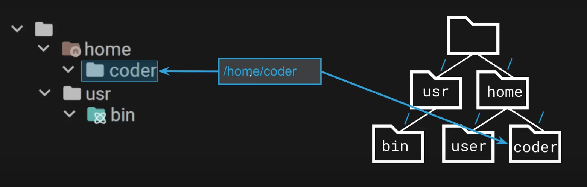

## CSE  240 - Introduction to Programming Languages

### Syllabus

#### Student Learning Outcomes

Upon completion of this course, you will be able to:

1. Develop programs and work within the linux environment
2. Develop C programs
   1. Work with C Arrays and String
   2. Use pointers
   3. Create custom variable types
   4. Build multi-file C programs
   5. Define and declare user defined data types
   6. Build C programs with multiple files
   7. Use the heapto create dynamic containers
   8. Incorporate and apply pointer
   9. Create and use classic data structures
3. Create C++ programs
   1. Write C++ programs using built-in functions and objects
   2. Create solutions using object-oriented programming concepts in C++
   3. Use advanced C++ constructs such as templates, templated containers, smart pointers, and operator overloading.
   4. Create programs using create objects implementing breadth first search and a min heap
4. Create Scheme Programs
   1. Write functions in Scheme and Prolog
   2. Use the Scheme and Prolog interpreters to test code
5. Create Prolog Programs
   1. Add facts and rules to a fact base
   2. Create queries to retrieve information from the fact base
6. Programming Language Analysis
   1. Describe the four programming language paradigms
   2. Categorize the major programming languages into a paradigm
   3. Debug programs in multiple languages.
   4. Write tests for programs based on the requirements

[Learning Objectives Details](https://docs.google.com/spreadsheets/d/1gKEb2iHg-rtNCAFNIkYTKseNPnHlZaU8K04M5TzbefI/edit?gid=0#gid=0)

#### Schedule and Grades

| Course Work | Qty | Drops | Points Per | Max Points |
|-------------|-----|-------|------------|------------|
| Project 1. Linux Assn | 1 | 0 | 10 | 10 |
| Project 2 | 1 | 0 | 10 | 10 |
| Project 3 | 1 | 0 | 30 | 30 |
| Exam 1 | 1 | 0 | 75   | 75 |
| Project 4 | 1 | 0 | 65 | 65 |
| Project 5 | 1 | 0 | 100 | 100 |
| Exam 2 | 1 | 0 | 75 | 75 |
| Project 6 | 1 | 0 | 100 | 100 |
| Project 7 | 1 | 0 | 100 | 100 |
| Project 8 | 1 | 0 | 0 | 0 |
| Exam 3 | 1 | 0 | 75 | 75 |
| Project 9 | 1 | 0 | 10 | 10 |
| Project 10 | 1 | 0 | 10 | 10 |
| Final Exam (Cumulative) | 1 | 0 | 100 | 100 |
| Lecture / Quiz | 12 | 0 | 10 | 120 |
| Follow Along Labs | 14 | 2 | 10 | 120 |

##### Extra Credit

- Project 8 will be for extra credit points (see below)
- For great memes posted to the Meme channel on Discord, helping your fellow students in Discord, and other community related activities
- Well formed questions on the Discord HW Help Channels (see directions on Discord)
- At course staff's discretion
  
##### Exam Replacements and Bonus

- By completing 70% or more of Projects 4 and 5 before exam 2's due date,  we will replace the exam 2's grade with  the weighted average of Projects 4 and 5 (even if you do not take the exam).

- By completing 70% or more of Projects 6, and 7 before exam 3's due date, we will replace exam 3's grade with the weighted average of Projects 6 and 7.

- By completing Project 8 before the Final Exam due date you will get up to 50 bonus points for the final exam.

##### Helpful Resources

<https://google.com>
<https://geeksforgeeks.org>
<https://stackoverflow.com>
<https://chat.openai.com>

Create a citation at <https://cse240.com/citations>

##### Course Content

- Ed lessons
- pwn.college
- class videos
- coding excercises
- quizzes

### Week 1

[Lab 01 - pwn.college setup](https://pwn.college/cse240-fa24~67476d68/lab01/)

- Register and connect asu id account to pwn.college
- Open a VSCode editor in pwn.college using the prompt
- Obtain flag through cat /flag command in terminal

[Lesson 1 - Developing Programs in Linux](https://canvas.asu.edu/courses/197532/modules/items/14308525)

1. Linux, The Terminal, and Bash
   1. Most interactions with a machine using Linux OS is done via Command Line Interface
   2. Done with a terminal that is used to interact with a shell
   3. the shell enables access to the operating system
      1. Windows Shells:
         1. Command Prompt
         2. Power Script
      2. Linux Shells:
         1. C Shell
         2. Bourne Shell
         3. <b>Bourne Again Shell (BASh)</b>
         4. Fish Shell
         5. Z Shell
2. Linux File System
   1. Organization
      1. Linux doesn't use drives like C:\, it uses forward slashes for directory access (Everything starts from / the <b>root</b> directory)
         1.    
            1. Absolute Paths (/home/coder/app/1/data)
            2. Relative path (app/1/data)
               1. Operators:
                  1. Single dot '.' = current directory
                  2. Double dot ".." = 1 directory up the chain
      2. After Loggin in:
         1. Terminal uses ~: 
            1. <i>coder@~/ $ as shorthand for working directory </i> 
            2. <i>coder@/home/coder/ $</i>
      3. Commands:
         1. pwd = print working directory
         2. cd = change directory
            1. Works with absolute and relative paths
3. Executing Programs
   1. Running a program from command line (cl) requires:
      1. Path to program
      2. Any arguments sent to the program
   2. The PATH is an environment variable
      1. Bash searches the Path looking for the filename and will find it if it is anywhere on the PATH
      2. our current directory "./" is usually not in the PATH and we must use "./" to execute a program in our current directory
4. Common Commands
   1. ls = Lists the files and directories within the directory
      1. common flags: -la - 
      2. Bash shortcut: ll for "ls -la" (not working in my desktop vs code?)
   2. File/Directory pattern matching
      1. \* Wild Card - 0 to any number of any character
         1. ls \* = lists all files
         2. ls \*.c = list all files that end in c
      2. ? Wild Card - single character
         1. ls file?.c = lists <i> file1.c, file2.c, fileA.c, file#.c, ....</i>
      3. mkdir - make directory
      4. mv - move directory 
         1. syntax = mv \<source> \<target>
         2. can also be used to rename using = mv \<oldname> \<newname>
            1. <i> mv data/config.xml data/me.xml </i>
      5. cp - Copy File
         1. syntax = cp \<file> \<target>
         2. same as mv rename, but this doesn't delete the original file
      6. rm - remove file or directories
         1. IF you delete it is <b>GONE!</b> (no recycling bin)
         2. for directory removal
            1. -r is required (recursive)
            2. removes the directory and <b>ALL</b> it's contents
         3. Other flags:
            1. -i = prompt user for each deletion
            2. rm * = removes everything that isn't a directory and doesn't start with period
            3. rm * -r = removes everything except items starting with a period in current directory
      7. echo - prints values provided as parameters to standard output (there is a default \n at the end)
      8. printf - prints the values provided as parameters to standard output
         1. String needs to be in quotes
         2. DOES NOT include a \n at the end
      9. cat - contents of a file to the terminal
      10. grep - searches a pattern and returns the lines that match
          1. means <b>global regular expression search and print</b>
          2. syntax = grep \<options> \<pattern> [file].
5. Redirecting I/O
    1. Standard Input - keyboard (file descriptor 0)
       1. < - redirects input of the target to the provided device or file 
       2. syntax = \<target>  <b><</b>  \<device or file>
       3. allows input without keyboard
    2. Stadard output - Terminal Response (file descriptor 1)
       1. \> \- redirects output from a program to a file
       2. syntax =  \<program output>  <b>></b>  \<file> 
    3. Standard error output - Terminal Error Response (file Descriptor 2)
    4. | - one output to another input
       1. syntax = \<standard output>  | \<standard input>
       2. <i>$ printf "2\n3\n1\n" | sort -n </i> (returns 1 2 3 with a new line for each)
       3. can pipe changes
6. Regular Expressions (regex)
   1. sequence of characters that define search patterns
   2. used for string matching, validation, and text processing
   3. Supports:
      1. Literals: meow
      2. Wildcard = "."
      3. Defines wildcard [a-zA-Z]
      4. Quantifiers:
         1. Come after literals, wildcards, or []
         2. Describes how many times the preceding item will occur
            1. Asterisk "\*" matches 0 or more occurrences
            2. Braces {n,m} matches between n and m occurrences
   4. Examples:
      1. Email Validation: [a-zA-Z0-9._%+-]\*@[a-zA-Z0-9.-]*
      2. Phone Number: ([0-9]{3}) [0-9]{3}-[0-9]{4}
7. Miscellaneous Linux
   1. Compile C Source Code
      1. gcc - compiles C Source to a binary executable
      2. -o is where to put the binary executable
      3. -g adds debbugging information
   2. Text Editors
      1. Vim v. Emacs
         1. Both very powerful, Both have quirky commands to learn, learn the basics of both, and get competent with one!
   3. Bash Tricks
      1. \<up arrow> - scrolls through recent command history
      2. \<tab> - tries to complete the command
   4. How do I use that Linux Command?
      1. Stack overflow, Manual Pages (man \<topic> in Linux), and chatgpt
   5. Build more skills?
      1. [Practice with MIT lessons](https://missing.csail.mit.edu/)
      2. [More challenges at overthewire.com/wargames/bandit](https://overthewire.org/wargames/bandit/)
8. Testing Frameworks
   1. [Video Explanation by Proffessor](https://youtu.be/ptcVx7bKbqg)