## CSE  240 - Introduction to Programming Languages

### Syllabus

#### Student Learning Outcomes

Upon completion of this course, you will be able to:

1. Develop programs and work within the linux environment
2. Develop C programs
   1. Work with C Arrays and String
   2. Use pointers
   3. Create custom variable types
   4. Build multi-file C programs
   5. Define and declare user defined data types
   6. Build C programs with multiple files
   7. Use the heapto create dynamic containers
   8. Incorporate and apply pointer
   9. Create and use classic data structures
3. Create C++ programs
   1. Write C++ programs using built-in functions and objects
   2. Create solutions using object-oriented programming concepts in C++
   3. Use advanced C++ constructs such as templates, templated containers, smart pointers, and operator overloading.
   4. Create programs using create objects implementing breadth first search and a min heap
4. Create Scheme Programs
   1. Write functions in Scheme and Prolog
   2. Use the Scheme and Prolog interpreters to test code
5. Create Prolog Programs
   1. Add facts and rules to a fact base
   2. Create queries to retrieve information from the fact base
6. Programming Language Analysis
   1. Describe the four programming language paradigms
   2. Categorize the major programming languages into a paradigm
   3. Debug programs in multiple languages.
   4. Write tests for programs based on the requirements

[Learning Objectives Details](https://docs.google.com/spreadsheets/d/1gKEb2iHg-rtNCAFNIkYTKseNPnHlZaU8K04M5TzbefI/edit?gid=0#gid=0)

#### Schedule and Grades

| Course Work | Qty | Drops | Points Per | Max Points |
|-------------|-----|-------|------------|------------|
| Project 1. Linux Assn | 1 | 0 | 10 | 10 |
| Project 2 | 1 | 0 | 10 | 10 |
| Project 3 | 1 | 0 | 30 | 30 |
| Exam 1 | 1 | 0 | 75   | 75 |
| Project 4 | 1 | 0 | 65 | 65 |
| Project 5 | 1 | 0 | 100 | 100 |
| Exam 2 | 1 | 0 | 75 | 75 |
| Project 6 | 1 | 0 | 100 | 100 |
| Project 7 | 1 | 0 | 100 | 100 |
| Project 8 | 1 | 0 | 0 | 0 |
| Exam 3 | 1 | 0 | 75 | 75 |
| Project 9 | 1 | 0 | 10 | 10 |
| Project 10 | 1 | 0 | 10 | 10 |
| Final Exam (Cumulative) | 1 | 0 | 100 | 100 |
| Lecture / Quiz | 12 | 0 | 10 | 120 |
| Follow Along Labs | 14 | 2 | 10 | 120 |

##### Extra Credit

- Project 8 will be for extra credit points (see below)
- For great memes posted to the Meme channel on Discord, helping your fellow students in Discord, and other community related activities
- Well formed questions on the Discord HW Help Channels (see directions on Discord)
- At course staff's discretion
  
##### Exam Replacements and Bonus

- By completing 70% or more of Projects 4 and 5 before exam 2's due date,  we will replace the exam 2's grade with  the weighted average of Projects 4 and 5 (even if you do not take the exam).

- By completing 70% or more of Projects 6, and 7 before exam 3's due date, we will replace exam 3's grade with the weighted average of Projects 6 and 7.

- By completing Project 8 before the Final Exam due date you will get up to 50 bonus points for the final exam.

##### Helpful Resources

<https://google.com>
<https://geeksforgeeks.org>
<https://stackoverflow.com>
<https://chat.openai.com>

Create a citation at <https://cse240.com/citations>

##### Course Content

- Ed lessons
- pwn.college
- class videos
- coding excercises
- quizzes

## Week 1

### [Lab 01 - pwn.college setup](https://pwn.college/cse240-fa24~67476d68/lab01/)

- Register and connect asu id account to pwn.college
- Open a VSCode editor in pwn.college using the prompt
- Obtain flag through cat /flag command in terminal

### [Lesson 1 - Developing Programs in Linux](https://canvas.asu.edu/courses/197532/modules/items/14308525)

1. #### Linux, The Terminal, and Bash

   1. Most interactions with a machine using Linux OS is done via Command Line Interface
   2. Done with a terminal that is used to interact with a shell
   3. the shell enables access to the operating system
      1. Windows Shells:
         1. Command Prompt
         2. Power Script
      2. Linux Shells:
         1. C Shell
         2. Bourne Shell
         3. **Bourne Again Shell (BASh)**
         4. Fish Shell
         5. Z Shell

2. #### Linux File System

   1. Organization
      1. Linux doesn't use drives like C:\, it uses forward slashes for directory access (Everything starts from / the **root** directory)
         1. 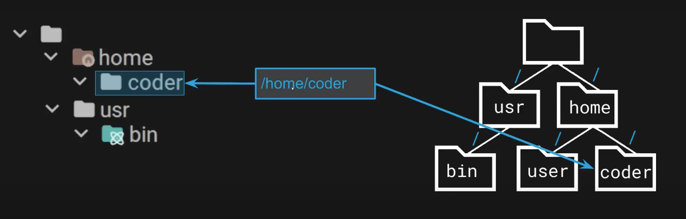{ width= 50% style="display: block; margin: 0 auto;"  }
            1. Absolute Paths (/home/coder/app/1/data)
            2. Relative path (app/1/data)
               1. Operators:
                  1. Single dot '.' = current directory
                  2. Double dot ".." = 1 directory up the chain
      2. After Loggin in:
         1. Terminal uses ~:
            1. **coder@~/ $ as shorthand for working directory**
            2. **coder@/home/coder/ $**
      3. Commands:
         1. pwd = print working directory
         2. cd = change directory
            1. Works with absolute and relative paths

3. #### Executing Programs

   1. Running a program from co
   2. Command line (cl) requires:
      1. Path to program
      2. Any arguments sent to the program
   3. The PATH is an environment variable
      1. Bash searches the Path looking for the filename and will find it if it is anywhere on the PATH
      2. our current directory "./" is usually not in the PATH and we must use "./" to execute a program in our current directory

4. #### Common Commands

   1. ls = Lists the files and directories within the directory
      1. common flags: -la -
      2. Bash shortcut: ll for "ls -la" (not working in my desktop vs code?)
   2. File/Directory pattern matching
      1. \* Wild Card - 0 to any number of any character
         1. ls \* = lists all files
         2. ls \*.c = list all files that end in c
      2. ? Wild Card - single character
         1. ls file?.c = lists **file1.c, file2.c, fileA.c, file#.c, ....**
      3. mkdir - make directory
      4. mv - move directory
         1. syntax = mv \<source> \<target>
         2. can also be used to rename using = mv \<oldname> \<newname>
            1. **mv data/config.xml data/me.xml**
      5. cp - Copy File
         1. syntax = cp \<file> \<target>
         2. same as mv rename, but this doesn't delete the original file
      6. rm - remove file or directories
         1. IF you delete it is **GONE!** (no recycling bin)
         2. for directory removal
            1. -r is required (recursive)
            2. removes the directory and ******ALL** it's contents
         3. Other flags:
            1. -i = prompt user for each deletion
            2. rm * = removes everything that isn't a directory and doesn't start with period
            3. rm * -r = removes everything except items starting with a period in current directory
      7. echo - prints values provided as parameters to standard output (there is a default \n at the end)
      8. printf - prints the values provided as parameters to standard output
         1. String needs to be in quotes
         2. DOES NOT include a \n at the end
      9. cat - contents of a file to the terminal
      10. grep - searches a pattern and returns the lines that match
          1. means **global regular expression search and print**
          2. syntax = grep \<options> \<pattern> [file].

5. #### Redirecting I/O

    1. Standard Input - keyboard (file descriptor 0)
       1. < - redirects input of the target to the provided device or file
       2. syntax = \<target>  **<**  \<device or file>
       3. allows input without keyboard
    2. Stadard output - Terminal Response (file descriptor 1)
       1. \> \- redirects output from a program to a file
       2. syntax =  \<program output>  **>**  \<file>
    3. Standard error output - Terminal Error Response (file Descriptor 2)
    4. | - one output to another input
       1. syntax = \<standard output>  | \<standard input>
       2. **$ printf "2\n3\n1\n" | sort -n** (returns 1 2 3 with a new line for each)
       3. can pipe changes

6. #### Regular Expressions (regex)

   1. sequence of characters that define search patterns
   2. used for string matching, validation, and text processing
   3. Supports:
      1. Literals: meow
      2. Wildcard = "."
      3. Defines wildcard [a-zA-Z]
      4. Quantifiers:
         1. Come after literals, wildcards, or []
         2. Describes how many times the preceding item will occur
            1. Asterisk "\*" matches 0 or more occurrences
            2. Braces {n,m} matches between n and m occurrences
   4. Examples:
      1. Email Validation: [a-zA-Z0-9._%+-]\*@[a-zA-Z0-9.-]*
      2. Phone Number: ([0-9]{3}) [0-9]{3}-[0-9]{4}

7. #### Miscellaneous Linux

   1. Compile C Source Code
      1. gcc - compiles C Source to a binary executable
      2. -o is where to put the binary executable
      3. -g adds debbugging information
   2. Text Editors
      1. Vim v. Emacs
         1. Both very powerful, Both have quirky commands to learn, learn the basics of both, and get competent with one!
   3. Bash Tricks
      1. \<up arrow> - scrolls through recent command history
      2. \<tab> - tries to complete the command
   4. How do I use that Linux Command?
      1. Stack overflow, Manual Pages (man \<topic> in Linux), and chatgpt
   5. Build more skills?
      1. [Practice with MIT lessons](https://missing.csail.mit.edu/)
      2. [More challenges at overthewire.com/wargames/bandit](https://overthewire.org/wargames/bandit/)

8. #### Testing Frameworks

    1. [Video Explanation by Proffessor](https://youtu.be/ptcVx7bKbqg)

### [Lesson 2.1 - Intro and C Vars](https://canvas.asu.edu/courses/197532/modules/items/14308529)

1. #### The four Paradigms & C

   1. A paradigm is a problem solving approach that is implemented within a programming language
      1. imperative (broader)
         1. Includes procedural and object oriented
            1. Procedural (C, Python)
               1. a sequence of statements
                  1. flow linearly
                  2. change the programs state
               2. code is organized into procedures with each procedure being responsible for a task
               3. conditionals, loops, branching
            2. object oriented (C++, Java, C#, Rust)
               1. black box objects that hide complexity inside
               2. encapsulation of state in objects
                  1. objects can be developed, tested, and debugged independently
                  2. reuse through inheritance and polymorphism
      2. functional / Applicative (Scheme)
         1. Higher level of abstraction
         2. Functions are the VIP
         3. Less use of state
      3. Logical (Prolog)
         1. Based on formal logic
         2. Programs are a series of rules and facts
         3. Query driven
         4. Traces relations between objects
   2. Why is C a procedural language?
      1. Sequential execution that uses linear flow by default
      2. C programs are organized into functions
      3. control structures (loops and conditionals)
      4. C uses variables to store state
      5. C does not support objectys
      6. C provides explicit control over memory and resources

2. #### First C Program and Variables

   1. Declaring Variables
      1. [\<qualifier>] \<data type> \<variable name>;
      2. [\<qualifier>] \<data type> \<variable name> [= \<value>];
   2. Primitive Data Types
      1. char
      2. int
      3. long
      4. float
      5. double
   3. **C Does not initialize a variable by default**
      1. ALWAYS INITIALIZE VARIABLES

3. #### Outputting to standard out

   1. 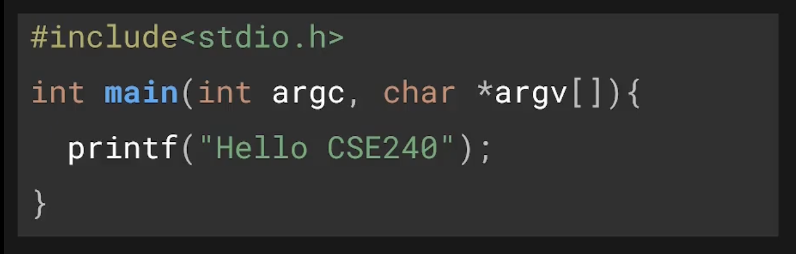{ width= 50% style="display: block; margin: 0 auto;"  }
   2. stdio.h gives access to:
      1. Output
         1. printf()
            1. int printf(const char *format, vars...);
            2. 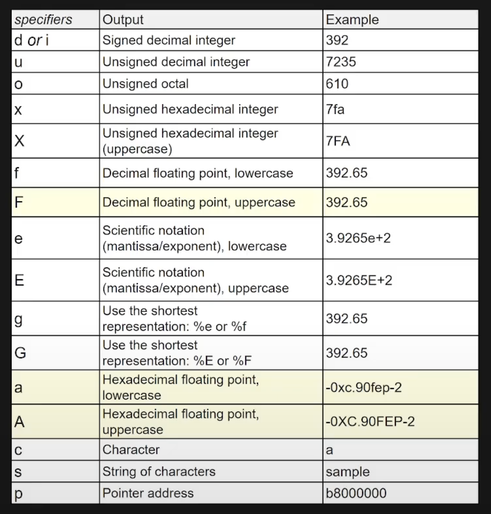{ width= 50% style="display: block; margin: 0 auto;"  }
               1. use % in front of specifiers
      2. Input
         1. scanf()
         2. gets()
         3. getchar()
      3. Output to file
         1. fprintf()
      4. Input to file
         1. fscanf()
      5. many more...

4. #### Input via Standard in

   1. getchar()
      1. returns a single character
      2. read in from standard input (usually keyboard)
   2. scanf()
      1. Rakes input from standard in and stores in a variable
      2. scanf("\<format specifier>", \<variable list>)
      3. Returns the nuber of calues read in.
      4. \<variable list> must be an address
         1. when using scanf() with int, char, float, etc.
            1. the argument must use the addressOf operator '&'.
      5. 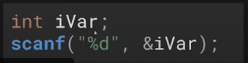{ width= 50% style="display: block; margin: 0 auto;"  }
      6. 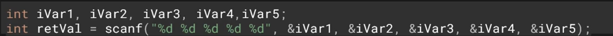{ width= 50% style="display: block; margin: 0 auto;"  }

5. #### Controling C Flow

   1. Accessing Program Arguments
      1. 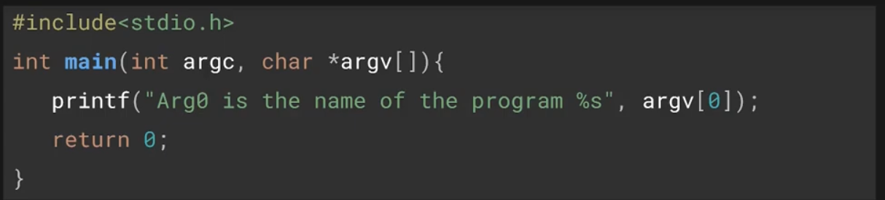{ width= 50% style="display: block; margin: 0 auto;"  }
         1. Access an argument after the name of the program
         2. start at index 1 (index 0 is the name of the program)

6. #### Declare and Define Cariables

   1. A declaration of a function is also called a function prototype
      1. includes:
         1. return type
            1. single value or void
         2. function name
         3. parameters
         4. DOES NOT INCLUDE FUNCTION BODY
      2. A Declaration before definition allows us to use it anywhere
      3. 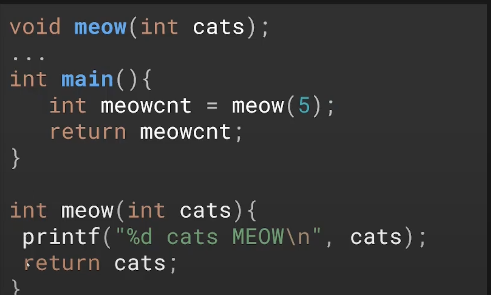{width= 50% style="display: block; margin: 0 auto;"  }
   2. The Definition includes the body with all declaration items

7. #### Global and Local Variables

   1. Scope
      1. The region of a program where the variable is accessible
         1. Begins when declared
         2. Continues until the end of that code block
      2. C Supports
         1. File Scope (Globals) - declared outside of {}
         2. Block Scope - declared in {}

8. #### Pass by Value

   1. This means it is a copy of the original variable
      1. Changes inside the function do not impact the original
   2. The only way to change a value and recieve it in the calling function is by using **return**. For now...

9. #### Storage of Globals and Locals in Memory

   1. ELF is a binary file format.
      1. It is made of sections:
         1. Text Section: the compiled instructions in binary format
         2. bss and data sections: contain global variables
         3. init sections: description of how to load the program
         4. linking sectionsL metadata describing the program components
         5. debug section: debugging information when -g is included
   2. 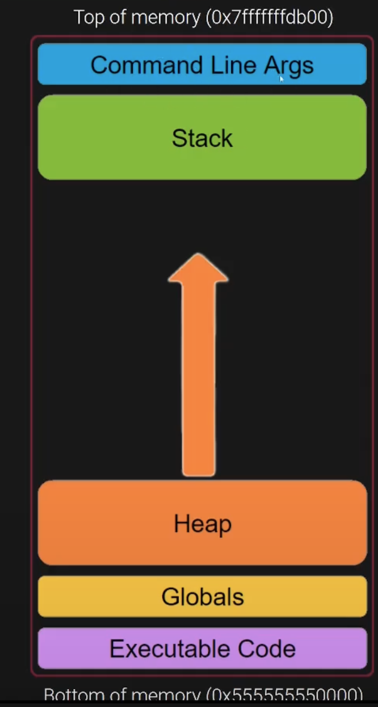{ width=50% style="display: block; margin: 0 auto;"  }
      1. local variables are in stack

10. #### Function Frames

       1. This is the area on the stack for a particular function.
       2. { width=50% style="display: block; margin: 0 auto;"  }

11. #### Debugging in C

      1. Faults
         1. Segmentation Fault
            1. Program accesses area of memory it's not permitted to access
               1. often this occurs when a variable points to 0 (aka. NULL)
      2. Debugging options
           1. Print Statements
           2. Run in Debug mode
              1. adding breakpoints
           3. GDB is a powerful command line debugger
              1. vs code debugger uses gdb behind the scenes
           4. Valgrin
              1. command line program good when unskilled at GDB

## Week 2

### [Lesson 2.2 - Arrays and C-Strings](https://canvas.asu.edu/courses/197532/modules/items/14308533)

1. #### Declaring and Defining Arrays

   1. What is an array?
      1. Section of contiguous memory based on a defined size
      2. In C, an array must have a size
      3. The size may be determined at runtime
   2. Example
      1. *int nbrs[8] = {. 0x0, 0x11, 0x22, 0x33, 0x44, 0x55, 0x66 };*
      2. 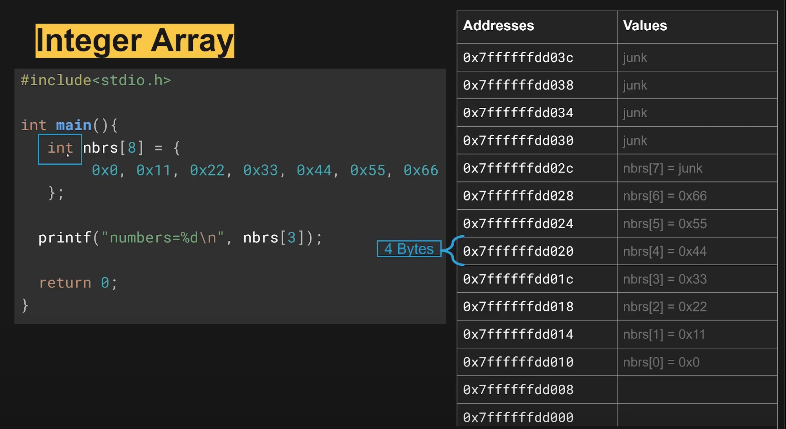{ width=50% style="display: block; margin: 0 auto;"  }
      3. 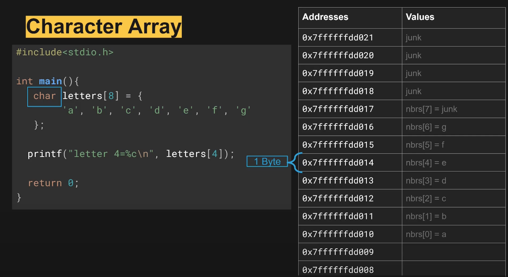{ width=50% style="display: block; margin: 0 auto; padding-top: 5px"  }
      4. 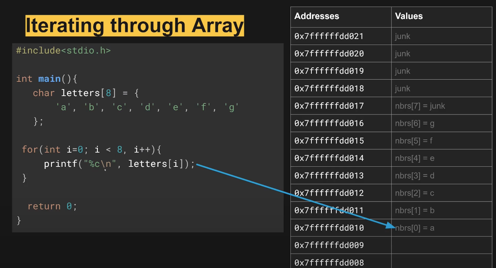{ width=50% style="display: block; margin: 0 auto; padding-top: 5px"  }

2. #### C String

   1. What is it?
      1. *char cstring[6] = "hello";*
         1. **Needs double quotes to declare in this declaration method**
         2. A character array becomes a C-string when the last element **contains a null character ('\0')**
         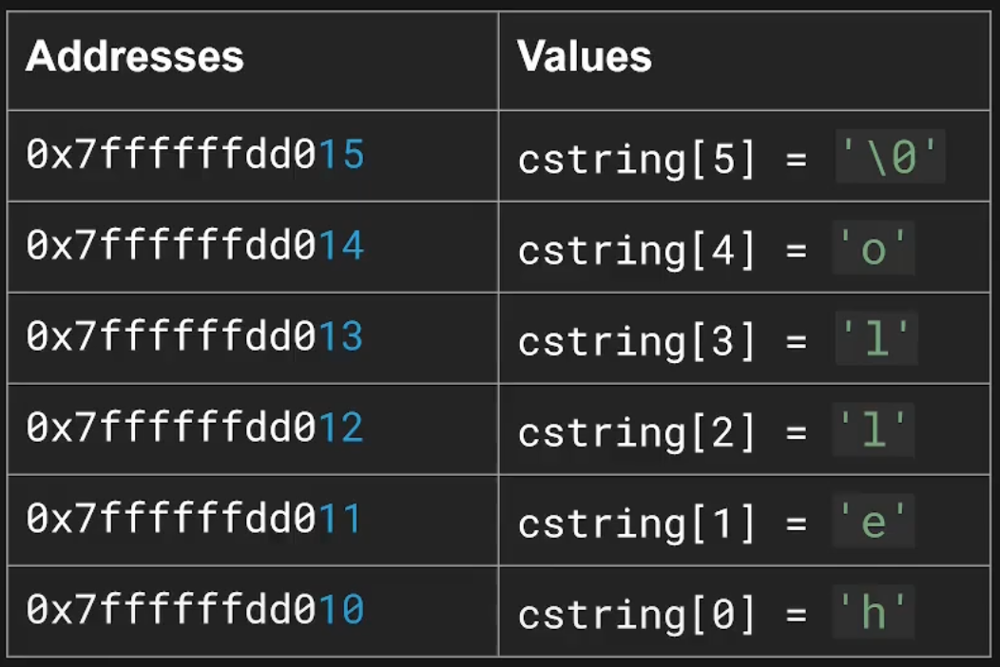{ width=50% style="display: block; margin: 0 auto;"  }
         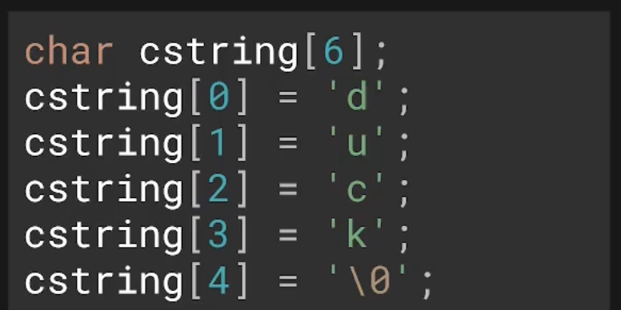{ width=50% style="display: block; margin: 0 auto; padding-top: 5px"  }
               1. This method doesn't need double quotes
         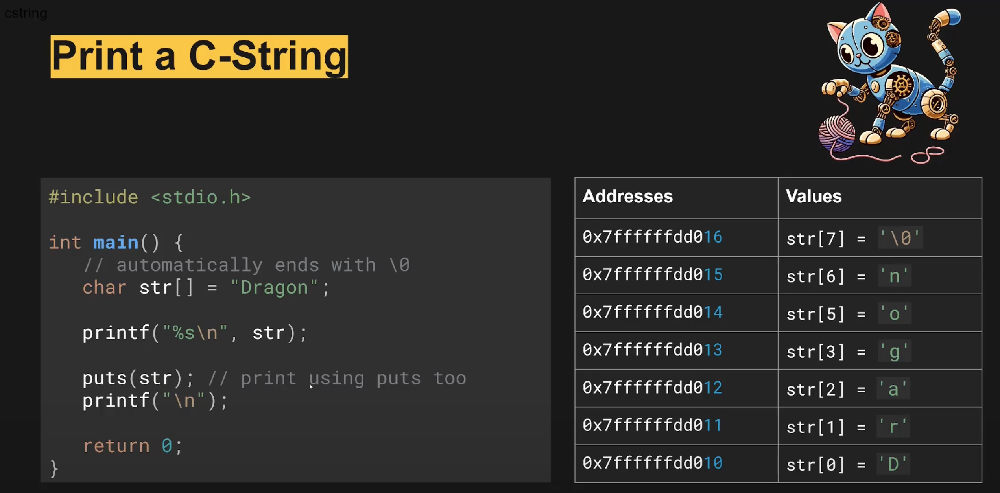{ width=50% style="display: block; margin: 0 auto;"  }
         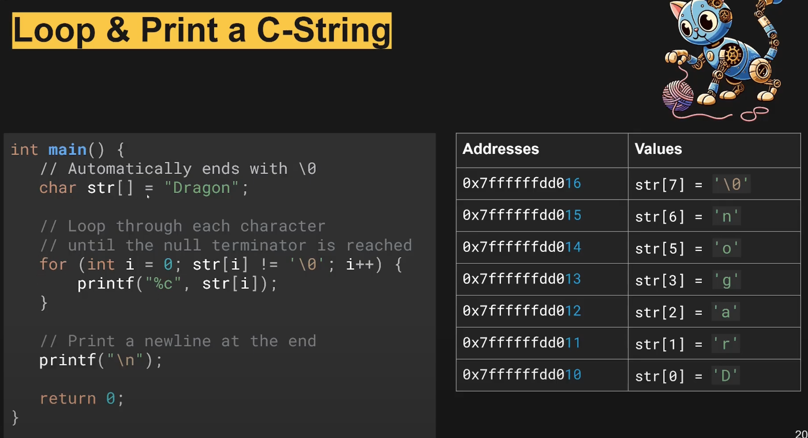{ width=50% style="display: block; margin: 0 auto; padding-top: 5px"  }

3. #### Input to String

   1. Standard Input
      1. Usually read from keyboard
      2. Can redirect files to it using '<'
      3. Can redirect program output to it using '|'
      4. The File handler for Standard Input is automatically setup
      5. When an input file is reguired you can use stdin to access Standard I,put
   2. scanf()
      1. takes input from standard in and stores it in a variable
         1. scanf("<format specifier>", <variable list>)
      2. can be used to read c-strings
         1. unlinke an int variable, c-strings don't need the '&'
         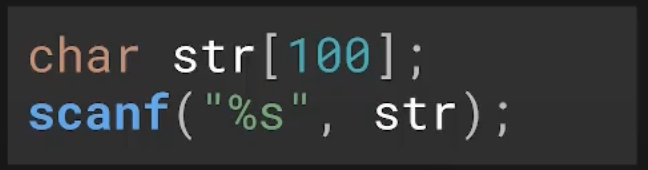{ width=50% style="display: block; margin: 0 auto;"  }
         2. Using "%s" reads until a space or newline (just like "%d")
            1. **It leaves the space or newline in the buffer too!** (must clear buffer for functionality of other scanf() calls)
   3. sscanf()
      1. Instead of reading from standard input this can be used to read from a c-string into variables
         1. handy for delimited files (Where there is a comma or tab)
      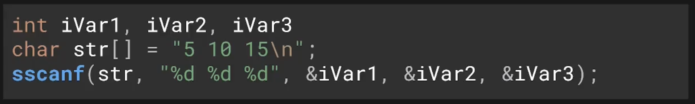{ width=50% style="display: block; margin: 0 auto;"  }

4. #### Using fgets

   1. Takes in 3 parameters
      1. Where the input is going to be stored
         1. **includes the newline in the input**
         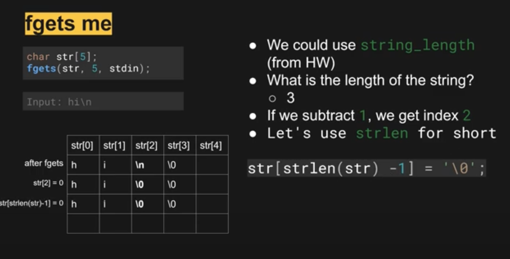{ width=50% style="display: block; margin: 0 auto;"  }
      2. max length that is allowed
      3. file where we recieve input from
   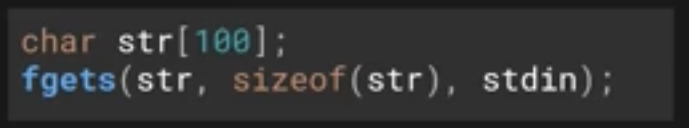{ width=50% style="display: block; margin: 0 auto;"  }
   2. will read until:
      1. a newline
      2. end of file
      3. reaches the specified size
   3. What happens if there is no newline?
      1. 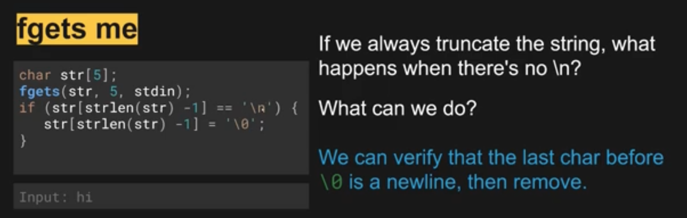{ width=50% style="display: block; margin: 0 auto;"  }

5. #### Input Buffer

   1. The input buffer is a hidden array used to hold input until requested
      1. All input functions that access standard input read from the input buffer.
         1. C: scanf, getchar, fgets, getline
         2. C==: cin, cin.get, cin.getline, cin.ignore
      2. We can use get char if input buffer has a '\n' and you want to call an fgets().
      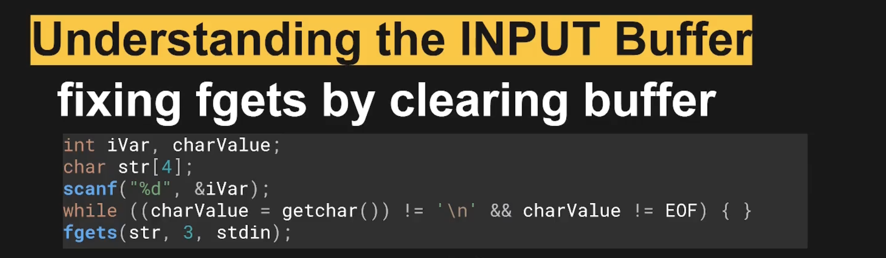{ width=50% style="display: block; margin: 0 auto;"  }

6. #### File Operations

   1. File Pointer
      1. We need a file pointer when working with C files
         1. *FILE * \<identifier>;* (This is a pointer)
   2. Opening a file
      1. *fopen("\<path>", "\<open for>")*
         1. open for:
            1. "w" for write
            2. "r" for read
      2. Example:
         1. *FILE = myFile = fopen("filename", "r")*
   3. fprintf() - Output
      1. Example:
         1. *fprintf(FILE * f, format_string, variables ... )*
            1. could use stdout instead of file and this would work just like printf()
            2. the fopenmmust open in write mode using "w"
      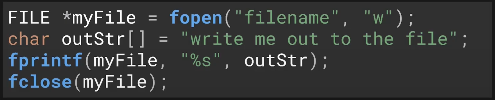{ width=50% style="display: block; margin: 0 auto;"  }
         2. fclose(); ensures no errors later.
   4. fgets() - input
      1. Instead of stdin (which is a built in file pointer)
         1. we can use the file we opened with fopen.
         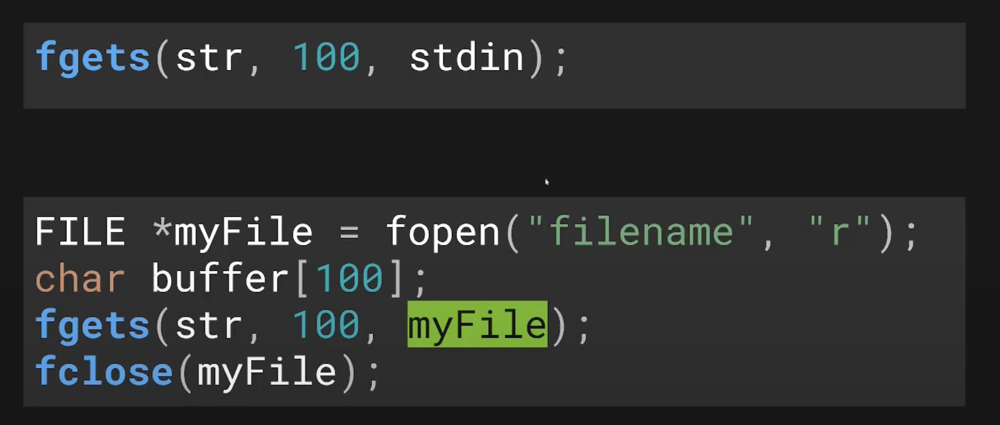{ width=50% style="display: block; margin: 0 auto;"  } 
   5. rewind();
      1. this resets the file pointer to the start of the file, the code will read from the beginning of the file.
      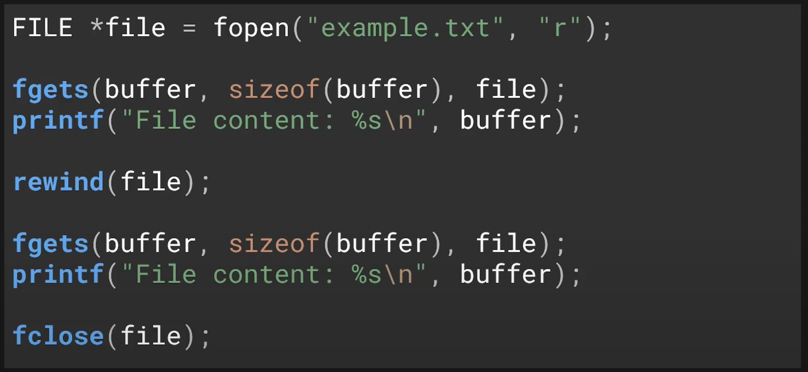{ width=50% style="display: block; margin: 0 auto;"  }

7. #### Group 1 - \<string.h> functions

   1. Group 1 C-String Functions
      1. #include \<string.h>
         1. strlen(str): returns length of the string, not counting null terminator
         2. strcmp(str1, str2): Compares two strings length.
            1. 0 = same value
            2. < 0 = str 1 less than str2
            3. > 0 = str1 greater than str2
         3. strcat(dest, src): Appemds src to end of dest.
         4. strncat(dest, src, n): appends at most n characters from the string src to dest.
         5. strcpy(dest, src): copies the src string to the destination overwriting whats there.
         6. strncopy(dest, src, n): overwrites up to n characters from src to dest.
            1. adds \0 to the end when dest is empty.
            2. \0 not added automatically if n is less than the length of both src and dest.

### [Lesson 2.3 - Local Pointers](https://canvas.asu.edu/courses/197532/assignments/5437100?module_item_id=14308537)

1. #### Variable Assignment Semantics

   1. Variable Assignments
      1. The meaning behind *x = 5*
         1. Variable Name: used to refer to a declaration
         2. **Binding**: an association between a name and an address
         3. Address: a position in memory.
         4. Value: Item held at that address
      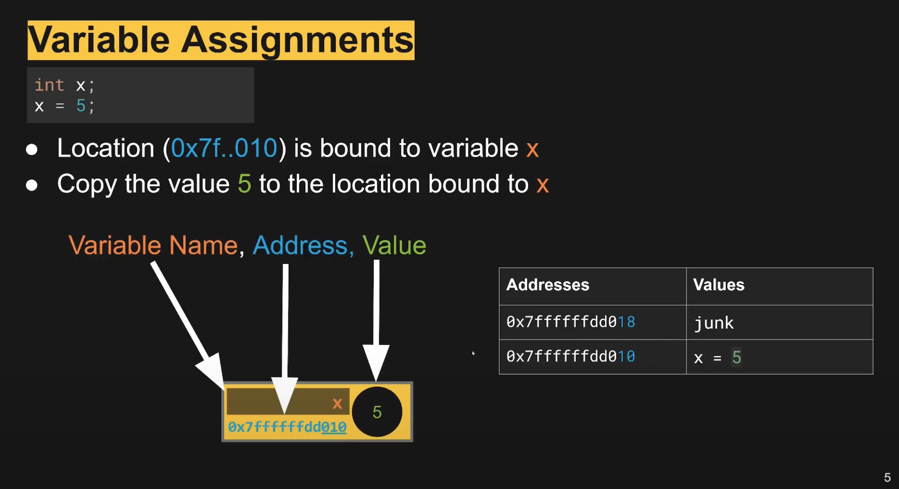{ width=50% style="display: block; margin: 0 auto;"  }
   2. What is there in a declaration?
      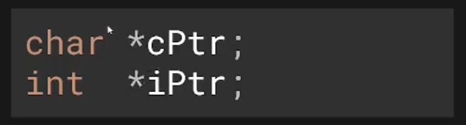{ width=50% style="display: block; margin: 0 auto;"  }
      1. The * in the declaration makes the variable a pointer
         1. This means the variable holds an address that points at a location in memory
      2. Only the Tyoes
         1. *int \*iPtr*
            1. holds an address that contains an int
      3. *&operator*
         1. Address of operator
            1. Unary Operator
         2. Returns an address of the type (the operand's type *)
            1. The value is the address of the operand
            2. **cannot be used to assign a value.**
      4. Example:
         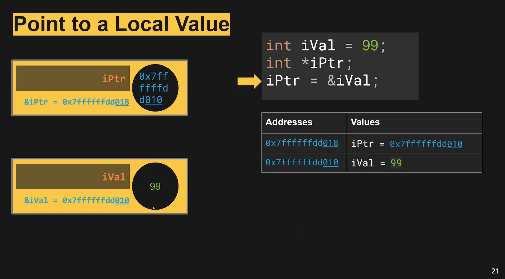{ width=50% style="display: block; margin: 0 auto;"  }
      5. Dereference operator '* operand' (When not being used for declaration)
         1. unary operator
         2. Returns the value of where the operand points to.
         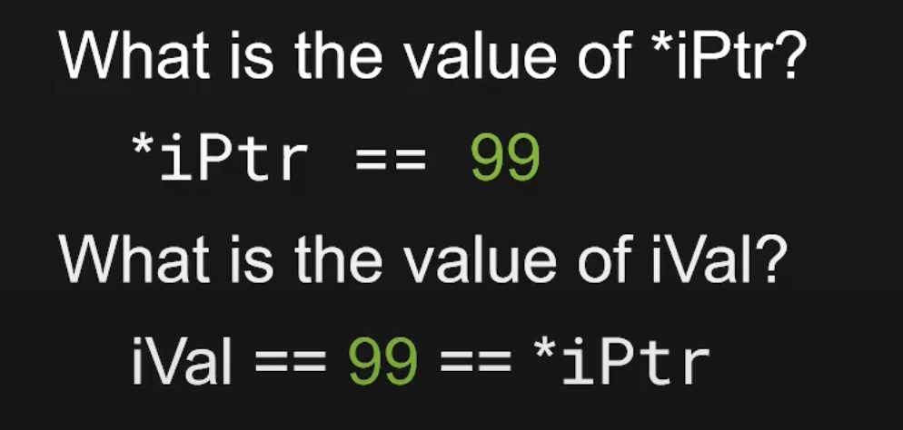{ width=50% style="display: block; margin: 0 auto;"  }
      6. Benefit
         1. Scanf with pointers means no more '&'.
         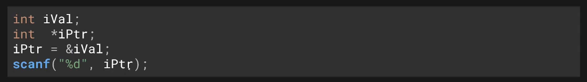{ width=50% style="display: block; margin: 0 auto;"  }

2. #### Declaring and Accessing Pointers

   1. Example 1:
      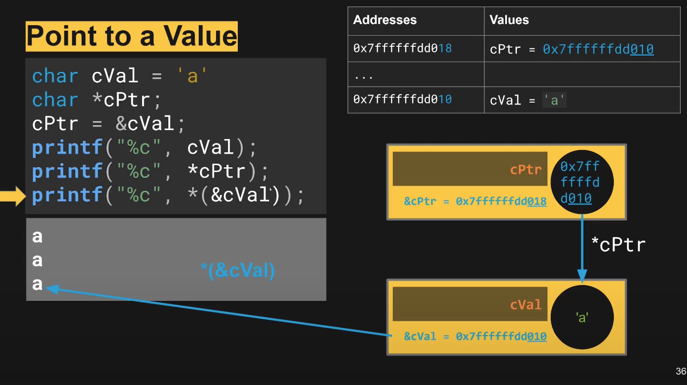{ width=50% style="display: block; margin: 0 auto;"  }
      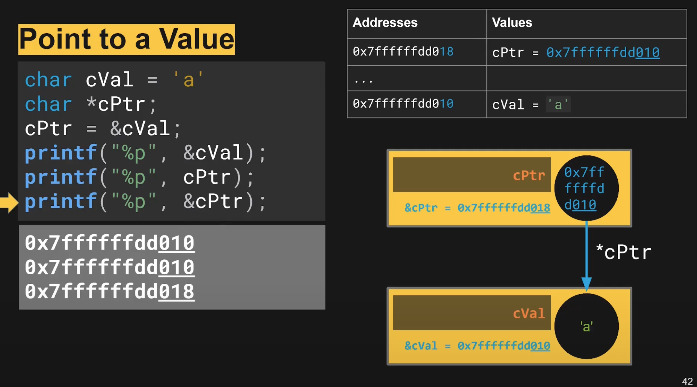{ width=50% style="display: block; margin: 0 auto;"  }
   2. Example 2:
      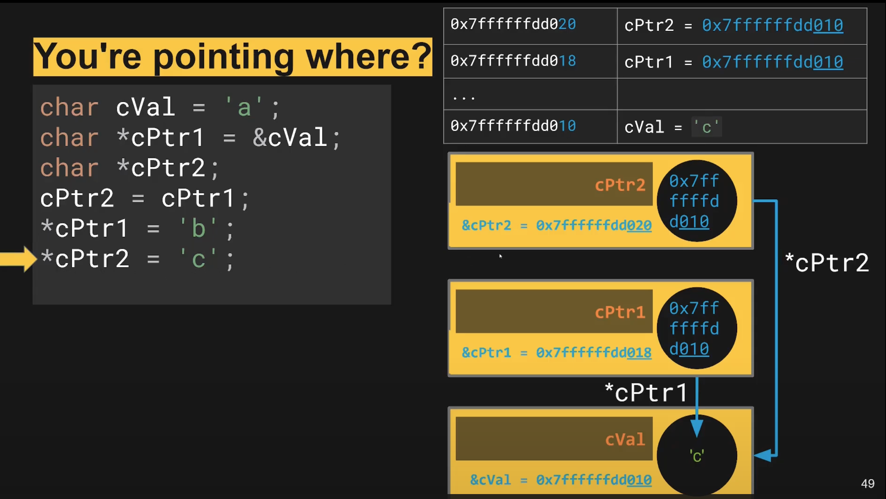{ width=50% style="display: block; margin: 0 auto;"  }

3. #### Pointers with Circle and Box

   1. Pointers Pointing to an Array - Example 1
      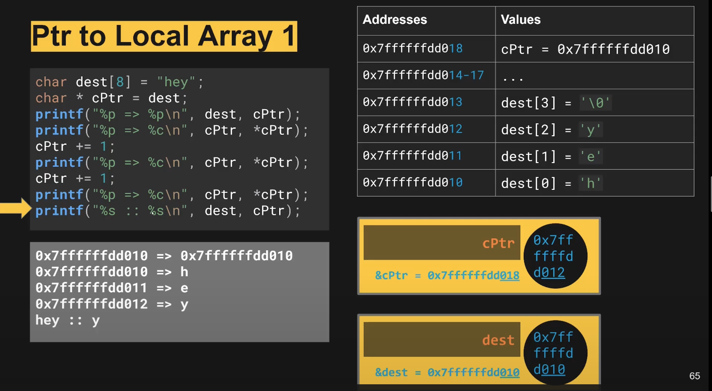{ width=50% style="display: block; margin: 0 auto;"  }
   2. Pointers Pointing to an Array - Example 2
      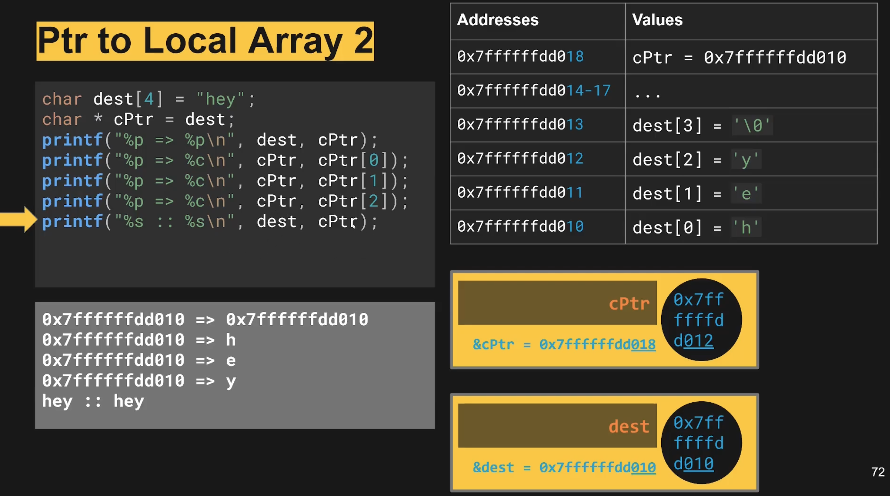{ width=50% style="display: block; margin: 0 auto;"  }
